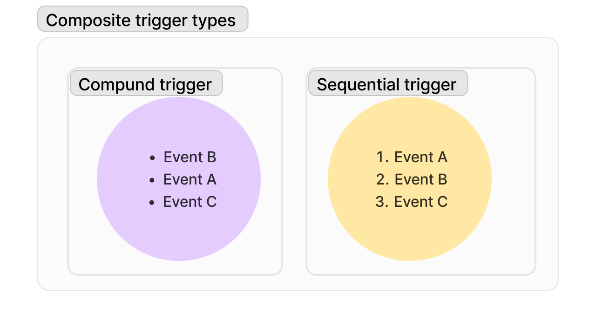

# Composite triggers

This repo contains a brief introduction to Prefect's composite triggers plus practice prompts for trying them out.

Triggers can be events or metrics.

A composite trigger is one made of multiple constituent triggers.

There are two types of composite triggers: compound and sequential.

## Compound & sequential triggers: what's the difference?

A compound trigger is a trigger that is activated by multiple underlying triggers that fire in any order. 
*The order in which these events occur doesn't matter*.

A sequential trigger is a trigger that is activated by multiple constituent triggers that occur *in a specific order*. 

A few other notes:

- An optional time limit for the constituent triggers to occur within may be specified.
- You can specify how many triggers that make up a composite trigger must occur for the composite trigger to fire. 
- Composite triggers can be nested.

## How to implement them?

See the [docs](https://docs.prefect.io/latest/concepts/automations), Guidry made some great examples and explanations.

Let's try them out! 

## Problem 1: Basic compound trigger

1. Make an automation with a trigger that fires when two different events occur in any specified order and within 2 minutes of each other.
1. Make the automation action to send an email.
1. Test it manually.

## Problem 2: Basic sequential trigger

1. Make an automation with a trigger that fires when two different events occur, but only in the specified order and within any time frame.
1. Make the automation action to send an email.
1. Test it manually.

## Problem 3: Compound trigger in event-driven workflow with custom payload -> deployment parameter

****Note: work here is ongoing and you may need to build from Main.****

1. Make an automation with a trigger that fires when two out of three custom events or webhook hits occur within three minutes of each other.
1. Make sure one of the custom events has a custom payload.
1. Run a deployment for the automation action.
1. Use the payload from the custom event as a parameter value for the deployment.
1. Test it manually.
